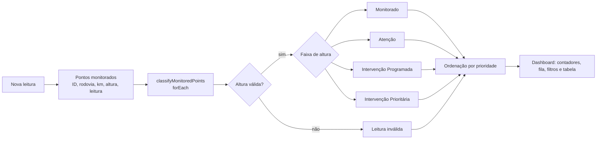

# GreenWatch — Sprint 4 de Application Development

## Integrantes

| Integrante | RM |
| --- | ---: |
| João Victor Alves de Abreu | 564946 |
| Luiz Henrique Barbosa Dias | 562399 |
| Rodrigo Kenshin Viana Matayoshi | 564026 |

### Monitoramento, classificação automática e priorização de atendimento da vegetação em trechos rodoviários

O **GreenWatch** é uma aplicação web de apoio à manutenção da vegetação ao longo de rodovias. Na Sprint 4 a solução deixa de apenas classificar localidades e passa a **processar vários pontos monitorados, classificar a condição de cada um, definir a prioridade e indicar a ação recomendada**, destacando os trechos que devem ser atendidos primeiro.

## Demonstração online

**[Acessar o GreenWatch](https://joaovictoraabreu-dev.github.io/Fiap-sprint03--application-development/)**

O workflow `deploy-pages.yml` publica as branches `sprint-03` e `sprint-04` no mesmo endereço do GitHub Pages: o que está no ar é a versão da última branch publicada.

| Informação acadêmica | Detalhes |
| --- | --- |
| Curso | 2º ano de Ciência da Computação |
| Disciplina | Application Development |
| Professor | Allan Roberto Molto |
| Período | 2º semestre — Sprint 4 |
| Valor da entrega | 10,0 pontos |

## Sumário

- [Objetivo da Sprint](#objetivo-da-sprint)
- [O que mudou em relação à Sprint 3](#o-que-mudou-em-relação-à-sprint-3)
- [Funcionalidades](#funcionalidades)
- [Regras de classificação](#regras-de-classificação)
- [Fluxo da solução](#fluxo-da-solução)
- [Atendimento aos critérios de avaliação](#atendimento-aos-critérios-de-avaliação)
- [Arquitetura e organização](#arquitetura-e-organização)
- [Tecnologias utilizadas](#tecnologias-utilizadas)
- [Como executar](#como-executar)
- [Qualidade e validação](#qualidade-e-validação)
- [Limitações](#limitações)
- [Vídeo Pitch](#vídeo-pitch)

## Objetivo da Sprint

Transformar os dados de altura da vegetação em informação para decisão: onde está o problema, qual a condição do ponto, qual a prioridade e qual ação tomar. A aplicação analisa automaticamente cada ponto monitorado, classifica a condição e organiza a fila de atendimento.

## O que mudou em relação à Sprint 3

| Aspecto | Sprint 3 | Sprint 4 |
| --- | --- | --- |
| Nomenclatura | Normal, Atenção, Risco, Crítico | Monitorado, Atenção, Intervenção Programada, Intervenção Prioritária (limites mantidos) |
| Modelo do ponto | Nome da cidade + coordenadas; altura associada pela posição em uma lista | Ponto com ID, rodovia, km, trecho, altura e data da última leitura; a altura pertence ao ponto |
| Prioridade | Inexistente | Cada faixa tem prioridade numérica; a lista é ordenada por prioridade e depois por altura |
| Destaque visual | Badge colorido | Badge, linha colorida na tabela, contadores por nível e fila de atendimento |
| Dados inválidos | A exceção podia interromper a renderização | Ponto vira "Leitura inválida" e o restante é processado normalmente |
| Atualização dinâmica | Apenas renderização | Filtros por classificação e rodovia + registro de nova leitura com reclassificação imediata |

## Funcionalidades

- classificação automática por altura, com faixas em um array de objetos (`VEGETATION_HEIGHT_BANDS`) e estruturas condicionais;
- processamento em lote de 15 pontos monitorados com `forEach()` (`classifyMonitoredPoints`);
- **prioridade de atendimento** por ponto e ordenação do mais urgente para o menos urgente;
- **fila de atendimento** com os pontos que exigem serviço de campo;
- contadores por classificação (inclui leituras inválidas);
- **filtros** por classificação e por rodovia;
- **registro de nova leitura**: o ponto é reclassificado e todo o painel se atualiza sem recarregar a página;
- identificação visual por cores em badge, linha da tabela e contadores;
- ação recomendada para cada ponto, inclusive para leitura inválida (revalidar o sensor);
- mapa, clima (Open-Meteo), sensoriamento fictício e alertas da Sprint 3 preservados; a classificação não depende dessas integrações.

## Regras de classificação

As regras foram definidas pelo grupo e estão centralizadas em `VEGETATION_HEIGHT_BANDS`. **Os limites são parâmetros deste protótipo e não correspondem a uma norma oficial da concessionária.**

| Faixa de altura | Classificação | Prioridade | Ação recomendada |
| --- | --- | --- | --- |
| De 0 a 30 cm | **Monitorado** | 1 | Manter o monitoramento de rotina |
| Acima de 30 até 50 cm | **Atenção** | 2 | Aumentar a frequência de inspeção do ponto |
| Acima de 50 até 80 cm | **Intervenção Programada** | 3 | Programar o serviço de roçada |
| Acima de 80 cm | **Intervenção Prioritária** | 4 | Realizar intervenção imediata e sinalizar a área |
| Sem leitura / valor inválido | **Leitura inválida** | 0 | Revalidar a leitura: verificar o sensor ou reinspecionar o ponto |

- Os limites 30, 50 e 80 cm pertencem à faixa que encerram (30 cm é "Monitorado").
- **Ordenação:** prioridade decrescente, depois altura decrescente, depois ID.
- **Fila de atendimento:** pontos com prioridade 3 ou 4.
- **Leitura inválida** (ausente, negativa, `NaN` ou infinita) não entra na fila nem na média de altura, mas é contada e destacada para não passar despercebida.

### Identificação visual

| Classificação | Cor |
| --- | --- |
| Monitorado | Verde |
| Atenção | Amarelo |
| Intervenção Programada | Laranja |
| Intervenção Prioritária | Vermelho |
| Leitura inválida | Cinza |

> [!IMPORTANT]
> Rodovias, quilometragens, trechos e alturas em `src/shared/constants/monitored-points.ts` são uma **massa de dados demonstrativa e determinística**. Não são medições reais de campo nem dados oficiais de uma concessionária. Alturas de 30, 50 e 80 cm exercitam os limites das faixas e o ponto `PT-015` simula falha de sensor. A estrutura está pronta para receber dados de sensores ou de uma API.

## Fluxo da solução



1. `MonitoredPointsProvider` mantém os pontos em estado React, inicializados pela fixture.
2. `classifyMonitoredPoints()` percorre os pontos com `forEach()` e chama `classifyMonitoredPoint()`, que usa `classifyVegetationHeight()` (condicionais) ou marca a leitura como inválida.
3. `sortByPriority()`, `getInterventionQueue()`, `summarizeByCondition()` e `filterPoints()` produzem as visões do painel.
4. Ao registrar uma leitura, `registerReading()` devolve uma nova lista; o React reclassifica e atualiza tudo.

## Atendimento aos critérios de avaliação

| Critério | Peso | Evidência no código |
| --- | --- | --- |
| Lógica de classificação da vegetação | 3,0 | `vegetation-height-bands.ts`, `vegetation-classification.util.ts`, testes de limites e de entrada inválida |
| Processamento dos dados e construção/atualização dinâmica do dashboard | 2,5 | `classifyMonitoredPoints` (`forEach`), `monitored-points.util.ts`, `MonitoredPointsProvider`, `ReadingForm`, `VegetationFilters` |
| Apresentação de localidades, condições e ações recomendadas | 2,5 | `VegetationMonitoringTable`, `InterventionQueue`, `ConditionSummary`, estilos em `condition-styles.ts` |
| Vídeo Pitch de 1 minuto no YouTube | 2,0 | Link na seção [Vídeo Pitch](#vídeo-pitch) |

### Evidências no código

| Arquivo | Responsabilidade |
| --- | --- |
| `src/shared/constants/vegetation-height-bands.ts` | Faixas, classificações, prioridades e ações |
| `src/shared/constants/monitored-points.ts` | Pontos monitorados demonstrativos |
| `src/shared/utils/vegetation-classification.util.ts` | Validação, condicionais e classificação em lote com `forEach()` |
| `src/shared/utils/monitored-points.util.ts` | Ordenação, fila, contadores, média, filtros e registro de leitura |
| `src/domain/entities/vegetation-monitoring.entity.ts` | Tipos do domínio |
| `src/app/providers/monitored-points.provider.tsx` | Estado compartilhado dos pontos |
| `src/presentation/components/vegetation/` | Painel, tabela, fila, filtros, contadores e formulário de leitura |
| `src/presentation/pages/dashboard.page.tsx` | Indicadores e composição do dashboard |
| `tests/unit/` | Testes automatizados |

## Arquitetura e organização

```
src/
├── app/                     # Roteamento e providers (inclui o estado dos pontos monitorados)
├── application/             # DTOs e mapeadores de dados externos
├── domain/                  # Entidades e tipos do domínio
├── infrastructure/          # Clientes HTTP e serviços de integração
├── presentation/
│   ├── components/          # Painel de vegetação, mapa e componentes compartilhados
│   ├── hooks/               # Consultas assíncronas e acesso ao estado dos pontos
│   ├── layouts/             # Estrutura visual compartilhada
│   └── pages/               # Dashboard, mapa, sensoriamento e alertas
├── shared/
│   ├── constants/           # Faixas, pontos monitorados e localidades de fallback
│   └── utils/               # Classificação, prioridade, filtros e cálculos auxiliares
└── styles/                  # Estilos globais
tests/unit/                  # Testes automatizados
```

Integrações externas (complementares, a classificação funciona sem elas): **OpenStreetMap Nominatim** (localidades do mapa e do clima) e **Open-Meteo** (clima atual).

## Tecnologias utilizadas

React 19, TypeScript, Vite 8, React Router, TanStack Query, Tailwind CSS, Axios, Leaflet e React Leaflet, Day.js, Vitest, ESLint. Não há backend: as regras de negócio são funções puras em `src/shared/utils`, o que as torna testáveis sem interface.

## Como executar

Pré-requisitos: Node.js 22.12+ (ou 20.19+) e npm 10+.

```bash
git clone https://github.com/JoaoVictorAAbreu-Dev/Fiap-sprint03--application-development.git
cd Fiap-sprint03--application-development
git checkout sprint-04
npm ci
cp .env.example .env   # Windows PowerShell: Copy-Item .env.example .env
npm run dev
```

O Vite informa o endereço local, normalmente `http://localhost:5173`.

| Comando | Finalidade |
| --- | --- |
| `npm run dev` | Servidor de desenvolvimento |
| `npm run test` | Testes unitários |
| `npm run typecheck` | Verificação de tipos |
| `npm run lint` | ESLint sem avisos |
| `npm run build` | Build de produção |
| `npm run preview` | Executa o build localmente |

## Qualidade e validação

```bash
npm run test && npm run typecheck && npm run lint && npm run build
```

Estado verificado ao final do desenvolvimento da Sprint 4:

- **36 testes unitários aprovados** em 7 arquivos (limites 30/50/80 cm, entradas inválidas, lote com leitura inválida, ordenação, fila, média, filtros e registro de leitura);
- verificação de tipos, lint (sem avisos) e build de produção aprovados.

## Limitações

- Os dados são demonstrativos; não há integração com sensores reais nem persistência: ao recarregar a página, as leituras registradas voltam ao estado inicial.
- As faixas de altura são parâmetros do protótipo, sem fonte normativa.
- Os testes cobrem a lógica; não há testes automatizados de interface.

## Vídeo Pitch

**Link do vídeo da Sprint 4: _a preencher após a gravação (YouTube)_**

Vídeo da Sprint 3: <https://youtu.be/VlhCzEI9VtM>
